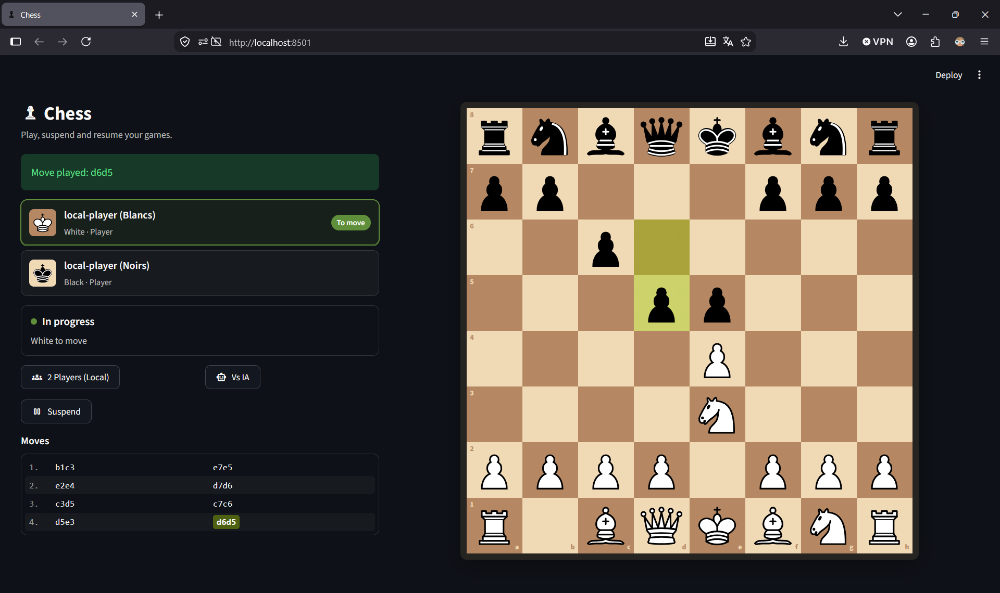

# Chess

A web-based chess game built with **Python**, **Streamlit**, and a layered architecture separating the domain, application, infrastructure, and presentation layers.

## 🎮 Application



## Requirements

* **Python 3.10 or newer**
* `pip`

No `make` installation is required.

## Project structure

```text
src/
└── chess_app/
    ├── domain/
    ├── application/
    ├── ports/
    ├── infrastructure/
    └── presentation/
        └── streamlit/
            ├── app.py
            ├── view.py
            ├── components/
            └── static/
```

### Architecture

* **domain** — chess rules and core domain objects
* **application** — application services, commands, queries and state
* **ports** — interfaces used by the application
* **infrastructure** — persistence and session implementations
* **presentation** — Streamlit web interface
* **static** — CSS and chess piece assets

## Installation

Create a virtual environment:

```bash
python -m venv .venv
```

Activate it.

### Windows

```bash
.venv\Scripts\activate
```

### Linux / macOS

```bash
source .venv/bin/activate
```

Install the project and its dependencies:

```bash
python -m pip install -e .
```

## Run locally

From the project root:

```bash
streamlit run src/chess_app/presentation/streamlit/app.py
```

Streamlit will start the local web application and provide the local URL in the terminal.

## Python version

The project requires **Python 3.10 or newer**.

You can check your version with:

```bash
python --version
```
